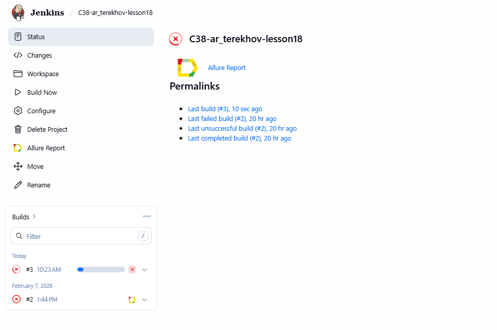
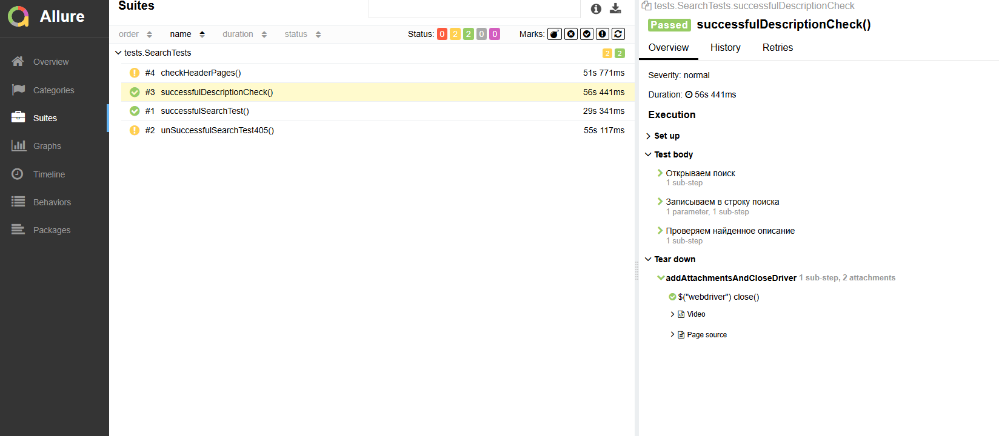

# Проект автоматизации [Wikipedia](https://www.wikipedia.org/)

> Wikipedia is a free online encyclopedia, created and edited by volunteers around the world and hosted by the Wikimedia Foundation.

## **Содержание:**
____

* <a href="#tools">Используемые технологии</a>

* <a href="#test-plan">Тест-план</a>

* <a href="#jenkins">Сборка Jenkins</a>

* <a href="#console">Запуск проекта</a>

* <a href="#allure">Allure report</a>

____

<a id="tools"></a>
## <a name="Используемые технологии">**Используемые технологии:**</a>

<p align="center">  
<a href="https://www.jetbrains.com/idea/"></a>  
<a href="https://www.java.com/"></a>  
<a href="https://junit.org/junit5/"></a>  
<a href="https://gradle.org/"></a> 
<a href="https://rest-assured.io/"></a>  
<a href="https://allurereport.org/"></a> 
<a href="https://www.jenkins.io/"></a>

</p>

____
<a id="test-plan"></a>

***Тест-план:***
- *Успешное получение информации по пользователю*
- *Успешное обновление информации по пользователю*
- *Успешное создание пользователя*
- *Успешное удаление пользователя*
- *Удаление пользователя с ошибкой без использования Api Key*

____
<a id="jenkins"></a>
## </a><a name="Build"></a>Сборка в [Jenkins](https://jenkins.autotests.cloud/job/C38-ar_terekhov-lesson13/)</a>
____
<p align="center">  
<a href="https://jenkins.autotests.cloud/job/C38-ar_terekhov-lesson13/"></a>  
</p>

___
<a id="console"></a>

## Команда для запуска через терминал  
***Запуск удаленного устройства:***
```bash  
./gradlew clean test -Dtype=remote
```

***Запуск локального эмулятора:***
```bash  
./gradlew clean test -Dtype=emulator
```
___
<a id="allure"></a>
## </a> <a name="Allure"></a>Allure [report](https://jenkins.autotests.cloud/job/C38-ar_terekhov-lesson13/allure/)</a>

### *Main report page*

<p align="center">  </p>

### *Suite*

<p align="center">  </p>

___
